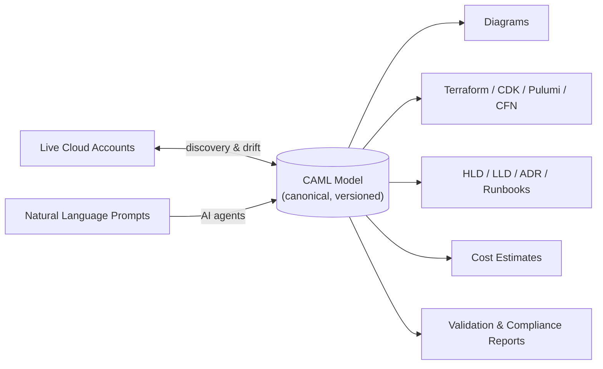

# 00 — Executive Summary

## Product

**Cloud Architect Copilot** — an AI-native platform where cloud architectures are designed,
validated, optimized, documented, deployed, and kept in sync with reality across AWS, Azure,
and GCP.

## The Problem

Cloud architecture today lives in four disconnected places that drift apart immediately:

1. **Diagrams** (Draw.io, Lucidchart, Visio) — pretty pictures with zero semantics. Stale the
   day after they're drawn.
2. **IaC** (Terraform, CloudFormation) — precise but unreadable to stakeholders; no design
   intent; reviewed line-by-line instead of architecturally.
3. **Documents** (HLDs, ADRs, runbooks) — written once, never updated.
4. **The actual cloud** — the only source of truth, visible only through 14 console tabs.

Every enterprise pays this tax: failed reviews, security findings discovered in production,
cost overruns from designs nobody validated, and weeks of consultant time producing
documentation that is wrong on delivery.

## The Insight

All four artifacts are projections of one underlying thing: **the architecture model**.
If you capture the model once — in a typed, cloud-agnostic, versioned DSL — every artifact
becomes generated, validated, and continuously synchronized:

## Why Now

- LLMs (Claude Opus-class models) can reliably emit structured architecture models when
  grounded in a knowledge graph and constrained by schemas — impossible in 2022.
- Cloud complexity has crossed the line where no human holds the full picture; AWS alone
  ships 200+ services.
- FinOps and compliance (CIS, PCI, HIPAA, EU regulations) make *provable* architecture a
  procurement requirement, not a nice-to-have.

## Competitive Position

| Competitor | What they have | What they lack |
|---|---|---|
| Draw.io / Lucidchart | Great canvas, huge user base | No semantics, no validation, no IaC, no sync |
| Cloudcraft | AWS-pretty diagrams, basic cost | AWS-only, no AI, no DSL, no validation engine |
| Hava | Auto-diagrams from live accounts | Read-only; can't design, validate, or generate |
| Brainboard / Cycloid | Terraform-first visual editing | Terraform-bound, weak AI, no multi-cloud translation |
| Copilots in consoles | Vendor AI | Single-cloud by construction; no neutral model |

**Our moat compounds**: the CAML model + the curated cloud knowledge graph + the corpus of
validated reference architectures grow with every customer and every cloud release. The
canvas is table stakes; the semantic layer is the defensible asset.

## Business Model

- **Free** — 3 architectures, public community library, exports with watermark.
- **Pro ($49/user/mo)** — unlimited architectures, AI generation, IaC export, cost analysis.
- **Team ($99/user/mo)** — collaboration, reviews/approvals, version control, RBAC.
- **Enterprise (custom)** — SSO/SAML, cloud sync & drift, compliance packs, audit, private
  knowledge base, VPC/BYOC deployment.

## Core Technical Bets (detailed in subsequent docs)

1. **CAML DSL** as canonical model; everything else is a projection (doc 05).
2. **Git-semantics versioning** (commits, branches, diff, merge) on architecture models (docs 03, 04).
3. **Multi-agent AI** over a Neo4j cloud knowledge graph + pgvector RAG, schema-constrained
   output (doc 07).
4. **React Flow + ELK.js** canvas with Yjs CRDT real-time collaboration (doc 06).
5. **Read-only, customer-controlled cloud connectors** (AWS cross-account role with external
   ID, Azure service principal, GCP workload identity federation) for discovery and drift (doc 09).
6. **Cell-based multi-tenant architecture** scaling from one Postgres to tenant-sharded cells
   without re-architecture (docs 04, 11).

## Headline Numbers (targets)

| Dimension | Target |
|---|---|
| Diagrams stored | 10M+ (designed for 100M) |
| Concurrent editors | 10k+ (50 per document) |
| AI generation latency | < 30s full architecture, streaming partials < 3s |
| Canvas render | 1,000-node diagram at 60fps |
| Availability | 99.9% (Pro) / 99.95% (Enterprise) |
| Discovery scale | 100k resources per cloud account |
