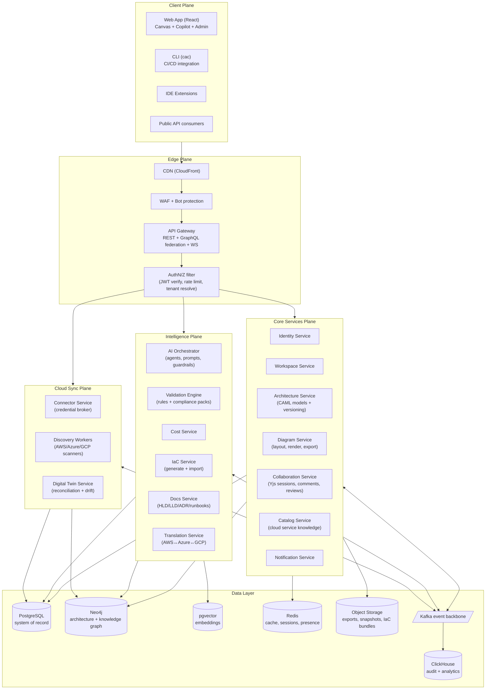

# 01 — Overall Product Architecture

## System-of-Systems View

The platform is organized into five planes. Each plane scales, deploys, and fails
independently; they communicate via APIs (synchronous) and a Kafka event backbone
(asynchronous).



## Plane Responsibilities

### Client Plane
- **Web app**: single React SPA hosting the canvas (doc 06), the AI copilot panel, model
  inspector, review UI, and org admin. Talks GraphQL for reads, REST for commands,
  WebSocket for collaboration and AI streaming.
- **CLI (`cac`)**: `cac validate`, `cac diff`, `cac export terraform`, `cac sync` — runs in
  CI to gate PRs on architecture policy. Same public API as third parties use.
- **IDE extension**: render CAML files in-editor, inline validation.

### Edge Plane
- Single ingress. TLS termination, WAF, DDoS protection, JWT verification, tenant
  resolution (token → `tenant_id` injected as trusted header), per-tenant rate limiting,
  request signing for service-to-service hops. GraphQL federation gateway composes
  subgraphs from core services.

### Core Services Plane (system of record)
- Owns durable business state. The **Architecture Service** is the heart: it stores CAML
  models as immutable, content-addressed commits (git semantics) and exposes
  branch/diff/merge. Everything in the Intelligence plane reads model commits and writes
  *proposals* (new commits on branches), never mutating state directly.

### Intelligence Plane (stateless compute over models)
- Every capability is a **pure function of (model commit, catalog, knowledge)** →
  artifact/report/proposal. This makes the plane horizontally scalable, cacheable
  (results keyed by commit hash), and safely retryable.

### Cloud Sync Plane (the only plane touching customer clouds)
- Isolated network segment; holds short-lived customer credentials only in memory;
  detailed in doc 09. Produces "observed model" commits that the Digital Twin diffs
  against the "designed model".

## The Canonical Data Flow

Every feature follows the same shape: **everything is a commit on a model**.

```mermaid
sequenceDiagram
    actor U as User
    participant GW as Gateway
    participant AI as AI Orchestrator
    participant A as Architecture Service
    participant V as Validation Engine
    participant K as Kafka

    U->>GW: "Design a multi-region e-commerce platform on AWS, 50M users"
    GW->>AI: POST /generate (prompt, workspace ctx)
    AI->>AI: Requirements agent → Design agent → Critic agent (doc 07)
    AI->>A: Create branch "ai/gen-7f3a", commit CAML model
    A->>K: event: architecture.commit.created
    K->>V: trigger validation
    V->>A: attach ValidationReport to commit
    A-->>GW: branch ref + commit hash (streamed progress via WS)
    GW-->>U: Diagram renders from CAML; explanations + findings panel
    U->>GW: Accept → merge branch to main
```

The same loop serves manual canvas edits (canvas emits CAML patches → commits),
cloud discovery (scanner emits observed commits), IaC import (parser emits commits),
and translation (translator emits a new model lineage). **One write path, audited once,
validated once.**

## Event Backbone — Topic Design

| Topic | Producers | Key consumers | Notes |
|---|---|---|---|
| `architecture.commits` | Architecture Svc | Validation, Cost, Search indexer, Twin | Keyed by `architecture_id`; compacted |
| `architecture.merged` | Architecture Svc | Docs, Notification, Audit | Triggers doc regeneration |
| `validation.completed` | Validation Engine | Notification, Web (via WS fanout) | |
| `discovery.resources` | Discovery Workers | Twin Service | High volume; partitioned by account |
| `twin.drift.detected` | Twin Service | Notification, Validation | |
| `ai.jobs` | AI Orchestrator | AI workers | Job queue semantics (also Redis streams for low latency) |
| `billing.usage` | All services | Metering pipeline | AI tokens, seats, scans |
| `audit.events` | All services | ClickHouse sink | Immutable, 7-year retention tier |

Conventions: CloudEvents 1.0 envelope, schema-registry (Avro), at-least-once delivery,
consumer idempotency via event IDs, outbox pattern in every producing service (no
dual-write bugs).

## Cross-Cutting Concerns

| Concern | Approach |
|---|---|
| Multi-tenancy | `tenant_id` on every row, every event, every cache key; Postgres RLS as second enforcement layer; cell-sharding at scale (doc 11) |
| Idempotency | All mutating REST endpoints accept `Idempotency-Key`; commits are content-addressed so replays are no-ops |
| Caching | Read models keyed by commit hash are immutable → cache forever; Redis for hot model JSON; CDN for exports |
| Observability | OpenTelemetry traces across gateway→services→agents; per-tenant SLO dashboards; AI spans capture model, tokens, cost |
| Failure isolation | Intelligence plane outage degrades to "manual design still works"; Sync plane outage degrades to "stale twin"; only Core plane is availability-critical |
| Backpressure | AI and discovery are queue-fed with per-tenant concurrency quotas; gateway sheds with 429 + Retry-After |

## Scalability Summary

- **Reads dominate** (canvas loads, renders): served from Redis/CDN-cached immutable
  commit snapshots; Postgres read replicas behind that.
- **Writes are small** (CAML patches ~KBs): single-writer-per-architecture via
  optimistic concurrency on branch head; no distributed transactions.
- **Hot collaboration state** (cursors, in-flight CRDT ops) lives in Redis + WS service
  memory, checkpointed to commits every N seconds — Postgres never sees keystroke traffic.
- **AI throughput** scales by adding stateless agent workers; cost-controlled by
  per-tenant token budgets.
- **Discovery** scales by account-partitioned workers; a 100k-resource account scans in
  parallel per-service-per-region.
