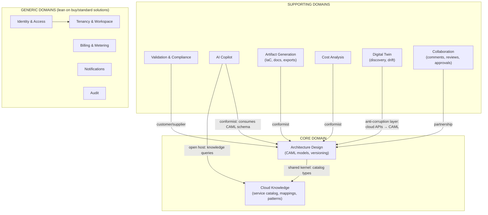
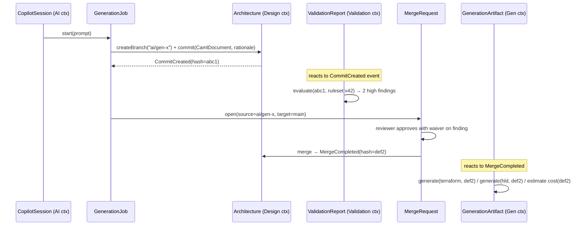

# 02 — Domain-Driven Design

## Context Map

**Strategic calls:**
- **Architecture Design + Cloud Knowledge are the core domain** — maximum in-house
  investment, no shortcuts.
- The **Digital Twin context wraps every cloud SDK behind an Anti-Corruption Layer**: raw
  AWS/Azure/GCP resource shapes never leak past it; it emits only CAML.
- Identity, billing, notifications are generic — buy (WorkOS, Stripe, Knock) and wrap.

---

## Bounded Context Details

### 1. Architecture Design (core)

The ubiquitous language here is deliberately git-like, because users (platform engineers)
already think in it.

**Aggregates:**

| Aggregate | Root | Invariants enforced |
|---|---|---|
| `Architecture` | Architecture | Name unique per workspace; default branch always exists; lifecycle (draft → active → archived) |
| `Branch` | Branch | Head must point to a commit in this architecture's lineage; protected branches require review to merge |
| `ModelCommit` | ModelCommit | **Immutable** after creation; content hash = SHA-256 of canonical CAML; parents form a DAG; model must validate against CAML JSON Schema |

**Entities:** `Architecture`, `Branch`, `ModelCommit`, `MergeRequest` (architecture-level
"PR": source/target branch, status, required approvals).

**Value Objects:**
- `CamlDocument` — the parsed model: immutable tree of `Component`, `Connection`,
  `Group`, `Policy`, `Metadata` (full schema in doc 05). Components/connections are VOs
  *within* a commit — they have identity only inside one model snapshot.
- `CommitHash`, `BranchRef`, `SemanticVersion`
- `ModelDiff` — typed change set: `ComponentAdded/Removed/Modified`,
  `ConnectionAdded/Removed`, `PolicyChanged` (never a text diff)
- `LayoutHints` — node positions/sizes; stored alongside model but **excluded from the
  content hash** (moving a box is not an architecture change)

**Key domain events:** `ArchitectureCreated`, `CommitCreated`, `BranchCreated`,
`MergeRequestOpened`, `MergeCompleted`, `ArchitectureArchived`.

**Domain services:** `MergeService` (3-way model merge with structural conflict
detection — conflicts are semantic: "both branches modified component X's instance size"),
`DiffService`.

### 2. Cloud Knowledge (core)

The curated, versioned encyclopedia of cloud services. Powers the palette, validation,
translation, cost, and AI grounding.

**Aggregates:**

| Aggregate | Root | Invariants |
|---|---|---|
| `AbstractServiceType` | AbstractServiceType | e.g. `compute.container.orchestrator`; taxonomy path unique; defines capability schema |
| `CloudService` | CloudService | e.g. `aws.eks`; must map to ≥1 abstract type; versioned property schema; deprecation lifecycle |
| `ReferencePattern` | ReferencePattern | A blessed partial CAML model (e.g. "3-tier web app", "hub-spoke network") with applicability rules |
| `EquivalenceMapping` | EquivalenceMapping | aws.eks ≈ azure.aks ≈ gcp.gke with fidelity score + caveat notes |

**Value objects:** `CapabilitySchema`, `PropertyDefinition` (name, type, constraints,
default), `FidelityScore`, `PricingDimension`.

### 3. Validation & Compliance (supporting)

**Aggregates:** `Rule` (id, category: reliability|security|performance|cost|operations,
severity, CEL/Rego expression over CAML, remediation template), `CompliancePack`
(CIS/NIST/PCI/HIPAA/SOC2 — versioned set of rule refs + evidence mapping),
`ValidationReport` (immutable; keyed by `(commit_hash, ruleset_version)` — same input
always yields same report, so reports are cacheable forever).

**Value objects:** `Finding` (rule, severity, component refs, message, remediation,
waivable?), `Waiver` (finding pattern, justification, approver, expiry).

### 4. AI Copilot (supporting)

**Aggregates:** `CopilotSession` (conversation root: messages, referenced commits,
token usage), `GenerationJob` (prompt → branch+commit proposal; states: queued →
planning → generating → critiquing → done/failed), `AgentTrace` (immutable record of
agent steps for debugging/audit).

**Value objects:** `Prompt`, `Assumption` (inferred requirement, confidence, surfaced to
user), `DesignRationale` (explanation attached to commits), `TokenBudget`.

### 5. Digital Twin (supporting)

**Aggregates:** `CloudConnection` (tenant's link to an AWS account / Azure subscription /
GCP project; credential ref — never the credential itself; scopes; health),
`DiscoverySnapshot` (immutable observed-state capture → produces an observed
ModelCommit), `DriftReport` (designed commit vs observed commit → `ModelDiff` +
classification: acceptable|review|violation).

**Value objects:** `ResourceFingerprint` (cloud ARN/ID + config hash), `DriftItem`,
`SyncPolicy` (auto-accept tags, ignore rules, schedule).

### 6. Collaboration (supporting)

**Aggregates:** `CommentThread` (anchored to component/connection/commit; resolved
state), `Review` (on a MergeRequest: verdict approve/request-changes, per-finding
dispositions), `PresenceSession` (ephemeral — Redis only, not persisted).

### 7. Identity & Access / Tenancy (generic)

**Aggregates:** `Tenant` (org: plan, SSO config, security policy), `Workspace`
(grouping within tenant; the RBAC boundary), `User`, `ServiceAccount` (API keys for
CI), `RoleAssignment` (principal × role × scope).

**Value objects:** `Role` (owner|admin|architect|editor|reviewer|viewer),
`Scope` (tenant|workspace|architecture), `SsoConfig`, `ApiKeyHash`.

### 8. Artifact Generation, Cost, Billing, Audit (supporting/generic)

- `GenerationArtifact` (IaC bundle / doc / export: input commit hash, generator version,
  output blob ref — immutable, reproducible).
- `CostEstimate` (commit hash × pricing snapshot date → line items; immutable).
- `AuditEvent` (actor, action, resource, before/after refs, IP, timestamp — append-only).

---

## Aggregate Interaction Example — "AI generates, team reviews, merge triggers artifacts"

## Ubiquitous Language Glossary (excerpt)

| Term | Meaning |
|---|---|
| **Model** | The CAML document — the architecture's semantic content |
| **Commit** | Immutable, content-addressed model snapshot with parents |
| **Designed vs Observed** | Designed = what users authored; Observed = what discovery found in the cloud |
| **Drift** | Diff between designed and observed lineages |
| **Projection** | Any artifact derived from a commit (diagram, IaC, doc, cost, report) |
| **Pack** | Versioned bundle of validation rules mapped to a compliance framework |
| **Pattern** | Blessed partial model, instantiable as a starting point or AI grounding |
| **Fidelity** | How faithfully a service translates across clouds (1.0 = drop-in, <0.7 = redesign advised) |
