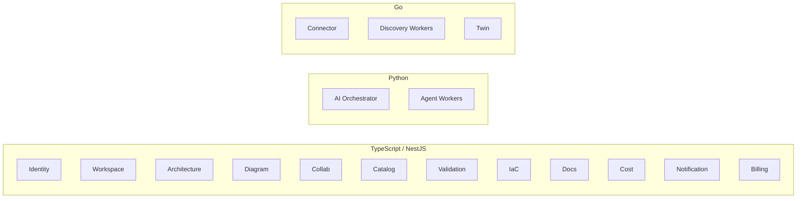

# 03 — Service Architecture

## Principles

- **Modular monolith first, extract along context boundaries.** MVP ships 3 deployables
  (Core app, AI workers, Web). Boundaries below are *logical* from day one (separate
  modules, separate schemas, events between them) so extraction is a deploy change, not
  a rewrite. Production phase splits into the services listed here.
- **Stateless services; state in the data layer.** Only the Collaboration service holds
  hot in-memory state (CRDT sessions), and it checkpoints.
- **Sync for queries/commands, async for everything that can be.** No service calls
  another service synchronously *and* transactionally.
- **Languages:** TypeScript/NestJS for product services (shared types with frontend, fast
  iteration), Python/FastAPI for AI Orchestrator (ML ecosystem), Go for Discovery workers
  (concurrency, cloud SDK maturity, memory footprint).

## Service Inventory

---

### 3.1 Identity Service
**Owns:** Users, service accounts, sessions, SSO federation, API keys.
**Build/Buy:** Wraps **WorkOS** for SSO/SAML/SCIM (doc 13); owns the user record and
token issuance itself (short-lived JWTs, RS256, JWKS endpoint for other services).

| API (REST) | Purpose |
|---|---|
| `POST /v1/auth/token` | Exchange (password \| OIDC code \| SAML assertion \| API key) for JWT pair |
| `POST /v1/auth/refresh` | Rotate refresh token (one-time-use, family revocation on reuse) |
| `GET /v1/users/me` | Profile + memberships |
| `POST /v1/service-accounts` | Create CI/CD identity, scoped API key |
| `GET /.well-known/jwks.json` | Public keys for gateway/services |

**Events out:** `user.created`, `user.deactivated`, `auth.suspicious` (→ audit).
**Scale:** trivially horizontal; Redis-backed token denylist.

### 3.2 Workspace Service
**Owns:** Tenants, workspaces, memberships, role assignments, plan entitlements, security
policies (IP allowlists, session length).

| API | Purpose |
|---|---|
| `POST /v1/tenants` / `GET /v1/tenants/{id}` | Org lifecycle |
| `POST /v1/workspaces` | Create workspace in tenant |
| `PUT /v1/workspaces/{id}/members/{userId}` | Assign role |
| `GET /v1/authz/check?principal=&action=&resource=` | Central authorization check (backed by Cerbos policy engine, heavily cached) |

**Events out:** `tenant.created`, `member.role.changed` (→ audit, cache invalidation).

### 3.3 Architecture Service ⭐ (the system of record)
**Owns:** Architectures, branches, commits (CAML), merge requests, diffs, tags/releases.

| API | Purpose |
|---|---|
| `POST /v1/architectures` | Create (empty or from template/pattern) |
| `GET /v1/architectures/{id}/branches/{branch}/model` | Resolve head commit → full CAML (ETag = commit hash) |
| `POST /v1/architectures/{id}/branches/{branch}/commits` | Append commit: full model or JSON-Patch against parent; optimistic lock on parent hash |
| `GET /v1/architectures/{id}/commits/{hash}` | Immutable commit fetch (cache forever) |
| `GET /v1/architectures/{id}/diff?from=&to=` | Typed ModelDiff |
| `POST /v1/architectures/{id}/merge-requests` | Open MR |
| `POST /v1/merge-requests/{id}/merge` | 3-way merge; 409 with conflict set if semantic conflicts |

**Internals:** canonicalizes CAML (sorted keys, normalized refs) before hashing; stores
commit metadata in Postgres, model bodies in Postgres JSONB with large models spilled to
S3; maintains a materialized "head model" per branch for O(1) reads; mirrors each commit's
component/connection graph into Neo4j for graph queries.
**Events out:** `architecture.commit.created`, `architecture.merged`, `architecture.tagged`.
**Scale:** write throughput is per-architecture serialized (optimistic concurrency) —
fine, since one team edits one architecture; reads are immutable-cacheable.

### 3.4 Diagram Service
**Owns:** Nothing durable except export artifacts. Pure projection: CAML → visual.

| API | Purpose |
|---|---|
| `POST /v1/render/layout` | CAML → positioned graph (ELK.js server-side for initial/auto layout) |
| `POST /v1/render/export` | commit + format (png\|svg\|pdf) + theme → artifact URL (async job for PDF/large) |
| `GET /v1/render/thumbnail/{commitHash}` | Cached thumbnail for dashboards |

**Internals:** headless Chromium pool for pixel-perfect PNG/PDF (same React renderer as
the client — one rendering codebase); SVG generated directly.
**Scale:** stateless render farm; thumbnails cached by commit hash in CDN.

### 3.5 Collaboration Service
**Owns:** Real-time sessions (Yjs CRDT docs over WebSocket), presence, comments, reviews.

| API | Purpose |
|---|---|
| `WS /v1/collab/{architectureId}/{branch}` | Yjs sync protocol + awareness (cursors, selections) |
| `POST /v1/comments` / `GET /v1/comments?anchor=` | Threads anchored to model elements |
| `POST /v1/reviews` | Review verdicts on merge requests |

**Internals:** y-websocket-compatible server; Redis pub/sub fans out across instances;
sticky-session by document via consistent hashing; CRDT state checkpointed to an
Architecture Service commit on idle/interval/disconnect ("auto-save = micro-commits",
squashed on merge).
**Scale:** one document's session lives on one node (with Redis-replicated standby);
nodes added for more concurrent documents. 50 editors/doc target.

### 3.6 Catalog Service
**Owns:** Cloud Knowledge context — abstract types, cloud services + property schemas,
equivalence mappings, reference patterns, icon assets.

| API | Purpose |
|---|---|
| `GET /v1/catalog/services?provider=aws&q=queue` | Palette search |
| `GET /v1/catalog/services/aws.eks` | Full property schema, capabilities, icons, doc links |
| `GET /v1/catalog/equivalents/aws.eks?target=azure` | Translation candidates + fidelity |
| `GET /v1/catalog/patterns?tags=ha,web` | Reference patterns (partial CAML) |

**Internals:** content is authored in a versioned internal repo ("catalog-as-code",
reviewed like code), published as immutable catalog versions; every commit pins the
catalog version it was authored against. Mirrored into Neo4j (for AI/graph queries) and
Redis (for palette latency).
**Scale:** read-only at runtime; cache everywhere.

### 3.7 AI Orchestrator + Agent Workers (Python)
**Owns:** Copilot sessions, generation/review/translation jobs, agent traces, prompt
registry, token budgets. Full design in doc 07.

| API | Purpose |
|---|---|
| `POST /v1/ai/generate` | NL prompt → GenerationJob (returns job id; progress over WS) |
| `POST /v1/ai/review` | commit → architecture review (strengths/risks/recommendations) |
| `POST /v1/ai/translate` | commit + target provider → translated model proposal |
| `POST /v1/ai/chat` | Conversational copilot grounded in current model |
| `GET /v1/ai/jobs/{id}` | Status, trace summary, result refs |

**Events out:** `ai.job.completed`, `billing.usage(tokens)`.
**Scale:** queue-fed workers; per-tenant concurrency + token budgets; result caching by
(prompt hash, commit hash) for review-type jobs.

### 3.8 Validation Engine
**Owns:** Rules, compliance packs, reports, waivers.

| API | Purpose |
|---|---|
| `POST /v1/validate` | commit hash + packs[] → report (sync <2s for ≤500 components, else async) |
| `GET /v1/reports/{commitHash}` | Cached report |
| `POST /v1/waivers` | Waive finding with justification + expiry (audited) |
| `GET /v1/rules` / `POST /v1/rules` (enterprise) | Custom rule management |

**Internals:** rules compiled to CEL expressions evaluated over a flattened CAML view +
Neo4j path queries for structural rules (SPOF detection = articulation-point analysis on
the component graph). Deterministic engine; AI agents *propose* but never decide findings.
**Events:** consumes `architecture.commit.created`; emits `validation.completed`.

### 3.9 IaC Service
**Owns:** IaC generation artifacts and IaC import parsing.

| API | Purpose |
|---|---|
| `POST /v1/iac/generate` | commit + target (terraform\|cdk-ts\|cloudformation\|pulumi-ts) + options (modules, state backend) → bundle (zip/tar in S3, or PR to customer repo via GitHub App) |
| `POST /v1/iac/import` | Terraform state/HCL or CFN template upload → CAML commit proposal |
| `GET /v1/iac/artifacts/{id}` | Download bundle |

**Internals:** generator = deterministic templates per catalog service (Handlebars/codegen
over typed IR) + AI only for glue/naming/README — generated code must be `terraform
validate`/`cdk synth` clean in CI golden tests. Import parses HCL/state via official
libs → ACL → CAML.
**Scale:** stateless; artifacts immutable by (commit, generator version).

### 3.10 Docs Service
**Owns:** Document generation (HLD, LLD, ADR, security review, runbook, DR guide).

| API | Purpose |
|---|---|
| `POST /v1/docs/generate` | commit + doc type + template + format (md\|docx\|pdf\|confluence) → artifact |
| `GET /v1/docs/templates` | Built-in + tenant custom templates |

**Internals:** structure/diagrams/tables generated deterministically from CAML; narrative
sections written by AI agents with the validation report and cost estimate as grounding;
ADRs seeded from `DesignRationale` captured at commit time.

### 3.11 Cost Service
**Owns:** Pricing data ingestion, estimates, optimization suggestions.

| API | Purpose |
|---|---|
| `POST /v1/cost/estimate` | commit + usage profile (req/s, storage GB, egress) → monthly/yearly breakdown |
| `GET /v1/cost/estimate/{commitHash}` | Cached estimate |
| `POST /v1/cost/compare?from=&to=` | Cost diff between commits (shown on every MR) |
| `GET /v1/cost/optimizations/{commitHash}` | Rightsizing/RI/spot/storage-class suggestions |

**Internals:** nightly ingestion of AWS Price List API, Azure Retail Prices API, GCP
Cloud Billing Catalog into a normalized pricing store; estimates are deterministic
(pricing snapshot pinned); usage assumptions explicit and editable.

### 3.12 Connector / Discovery / Twin (Go) — detailed in doc 09
- **Connector:** registers cloud connections, brokers short-lived credentials
  (STS AssumeRole / Azure SP / GCP WIF), health checks, scope verification.
- **Discovery Workers:** per-provider scanners → normalized resources → ACL → observed
  CAML commits. AWS path prefers Resource Explorer + Config aggregator when available,
  falls back to direct describes.
- **Twin:** schedules discovery, reconciles designed vs observed (matching via
  fingerprints + IaC-generated tags), produces DriftReports, powers
  "import my account as a diagram".

### 3.13 Notification Service
Email/Slack/Teams/webhooks + in-app inbox. Wraps **Knock** (buy). Consumes domain events,
applies user/tenant preferences.

### 3.14 Billing Service
Wraps **Stripe**. Meters: seats, AI tokens, cloud connections, scans. Consumes
`billing.usage` events; enforces entitlements via Workspace Service.

---

## Service Communication Matrix (who calls whom synchronously)

| Caller → Callee | Why |
|---|---|
| Gateway → all | Routing |
| * → Workspace `/authz/check` | Authorization (cached, <1ms p50) |
| AI Orchestrator → Architecture, Catalog, Validation, Cost | Read models/knowledge; commit proposals |
| Validation → Architecture, Catalog, Neo4j | Fetch commit + schemas |
| IaC/Docs/Cost → Architecture, Catalog | Fetch commit |
| Twin → Architecture | Commit observed models |
| Collab → Architecture | Checkpoint commits |

Everything else is event-driven. No synchronous chains deeper than 2 hops.
