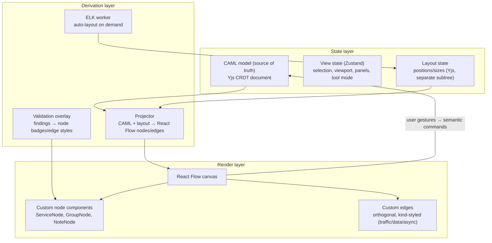

# 06 — Canvas Architecture

## Decision: React Flow (xyflow) + ELK.js, with a custom semantic layer

| Option | Verdict | Reasoning |
|---|---|---|
| **React Flow (@xyflow/react)** | ✅ Core canvas | React-native component model (custom nodes = React components → cloud service cards with badges, status, live validation markers are just components); built-in pan/zoom/selection/minimap; controlled state model fits our CAML-as-source-of-truth; large community; MIT. Handles ~1–2k nodes with virtualization + memoization, which covers P99 of architectures. |
| **ELK.js** | ✅ Auto-layout engine | The only JS layout engine that does **hierarchical containment + orthogonal edge routing** well — exactly the VPC ⊃ subnet ⊃ instance nesting problem. Layered algorithm ("elk.layered") gives the left-to-right traffic-flow look architects expect. Runs in a Web Worker (client) and Node (server-side initial layout). |
| **Dagre** | ❌ Rejected | Fast and simple but no compound/nested graph support worth using — fatal for cloud diagrams where containment *is* the semantics. Fine fallback for simple tree layouts (e.g. doc diagrams). |
| **Graphviz (wasm)** | ❌ Rejected for canvas, ✅ for batch | Best-in-class routing quality, but layouts are non-deterministic-feeling under incremental change (small model change → global reshuffle = jarring UX). We keep dot export as a power-user feature. |
| **Custom WebGL canvas (e.g. Pixi)** | ❌ Deferred | Needed only past ~5k visible nodes. Escape hatch: React Flow node rendering is swappable; revisit if discovery-scale diagrams (10k+ resources) must be fully rendered rather than clustered. |
| Build from scratch (SVG/Canvas2D) | ❌ | 12+ engineer-months to reach React Flow parity; zero differentiation — our moat is the semantic layer, not pan/zoom. |

## Layered Frontend Architecture

**The key discipline:** the canvas never owns truth. Every gesture becomes a **semantic
command** (`AddComponent`, `Connect`, `MoveToGroup`, `SetProperty`, `Reposition`) applied
to the Yjs CAML/layout document; React Flow state is a memoized projection. This is what
makes undo/redo, collaboration, AI co-editing, and versioning compose instead of fight.

## Command & Undo System

- All mutations flow through a `CommandBus`: `execute(cmd)` → CAML patch → Yjs
  transaction (origin-tagged per user).
- **Undo/redo = Yjs UndoManager scoped to the local user's origin** — undoing your change
  doesn't undo a collaborator's (Figma semantics).
- Commands carry semantic grouping (drag = one command despite 60 position events,
  AI-applied changesets = one undoable unit).
- Keyboard map: standard set (⌘C/V/X/Z/⇧Z/D, arrows nudge, ⌘A, ⌘G group, Del, Space pan,
  ⌘± zoom, ⌘K command palette). Copy/paste serializes CAML fragments to the clipboard as
  `application/x-caml+json` (+ PNG fallback) — paste into another architecture re-maps IDs.

## Real-Time Collaboration

- **Yjs CRDT** over the Collaboration Service WebSocket (doc 03 §3.5):
  - `model` map → CAML content (components/connections/groups/policies as Y.Maps keyed by
    stable ID — concurrent property edits merge per-field)
  - `layout` map → positions (high-frequency, hash-excluded)
  - `awareness` → cursors, selections, viewport-follow ("observe mode")
- Conflict story: CRDT handles concurrent edits structurally; *semantic* conflicts (two
  users binding the same component to different services) surface as validation warnings,
  not lost updates.
- Offline: Yjs persists to IndexedDB; reconnect merges; if the branch head moved
  meanwhile, client receives a rebase prompt (diff view) rather than silent merge.

## Rendering Performance Plan

| Technique | Detail |
|---|---|
| Node virtualization | `onlyRenderVisibleElements` + custom culling for group children |
| Memoized projection | Projector diffs CAML by ID; only changed nodes re-render |
| Level-of-detail | Zoom < 0.4 → nodes render as colored chips (no text/icons); < 0.15 → groups only |
| Edge simplification | > 500 visible edges → straight lines until interaction pause, then re-route orthogonally |
| Layout in worker | ELK runs off-main-thread; canvas animates to new positions |
| Clustering | Discovery-scale models auto-cluster by group ("expand subnet" drill-down) — never draw 10k nodes |
| Target | 1,000 nodes / 1,500 edges at 60fps interaction on an M-class laptop |

## Auto-Layout Strategy

- **Initial layout** (AI generation, import, discovery): server-side ELK layered,
  direction LEFT→RIGHT, `hierarchyHandling: INCLUDE_CHILDREN` for nested groups,
  orthogonal edge routing, then stored as the commit's layout sidecar.
- **Incremental**: new components placed by local heuristic (near connected neighbors,
  inside their group, collision-avoided) — full re-layout only on explicit "Tidy up"
  (with animated transition + undoable).
- **Containment rendering**: groups are React Flow parent nodes (`extent: 'parent'`),
  auto-sized to children + padding; region/VPC/subnet get provider-styled headers
  (AWS dark blue, Azure blue, GCP red accents) matching official architecture-icon
  conventions (we license/bundle official AWS/Azure/GCP icon sets).

## Export Pipeline

| Format | Path |
|---|---|
| PNG | Client: html-to-image of the flow viewport (quick share). Server: headless Chromium running the same React renderer (pixel-perfect, watermark policy, any size) |
| SVG | Server-side dedicated SVG serializer from projected graph (true vectors, embedded icon symbols, selectable text) |
| PDF | SVG → PDF (paged, title block, legend, validation summary appendix optional) |
| Draw.io XML | Bidirectional: export mapping nodes→mxCells with CAML metadata embedded in cell attributes (re-import round-trips losslessly); import maps recognized shape styles → catalog services, unrecognized → generic nodes |
| Visio / Lucid | Import via their export formats (VSDX is OOXML; Lucid via its Draw.io-compatible export); export not in v1 |

## Import Heuristics (diagram → CAML)

1. Parse source format → shapes + containment + connectors.
2. Shape classifier: style/icon fingerprint table (Draw.io AWS/Azure/GCP shape libraries
   have stable style strings) → catalog service; fallback: text-label embedding match
   against catalog (vector search); final fallback: `generic.unmodeled`.
3. Containment → groups (heuristics: label regex for VPC/subnet/region + geometry).
4. Emit CAML commit flagged `origin: iac_import` with per-component confidence; the UI
   runs a "review imported mapping" wizard for low-confidence nodes.

## Frontend Stack Summary

| Concern | Choice |
|---|---|
| Framework | React 19 + TypeScript, Vite |
| Canvas | @xyflow/react (React Flow 12) |
| Layout | elkjs in Web Worker + server |
| Local/view state | Zustand |
| Server cache | TanStack Query (GraphQL via graphql-request + codegen) |
| Collab | Yjs + custom y-websocket provider |
| Design system | Radix primitives + Tailwind; tokens themed light/dark |
| Property forms | JSON-Schema-driven form generator from catalog schemas (one renderer for all 450+ services — no hand-built forms) |
| Testing | Vitest + Playwright (canvas interaction suites run against seeded models) |
