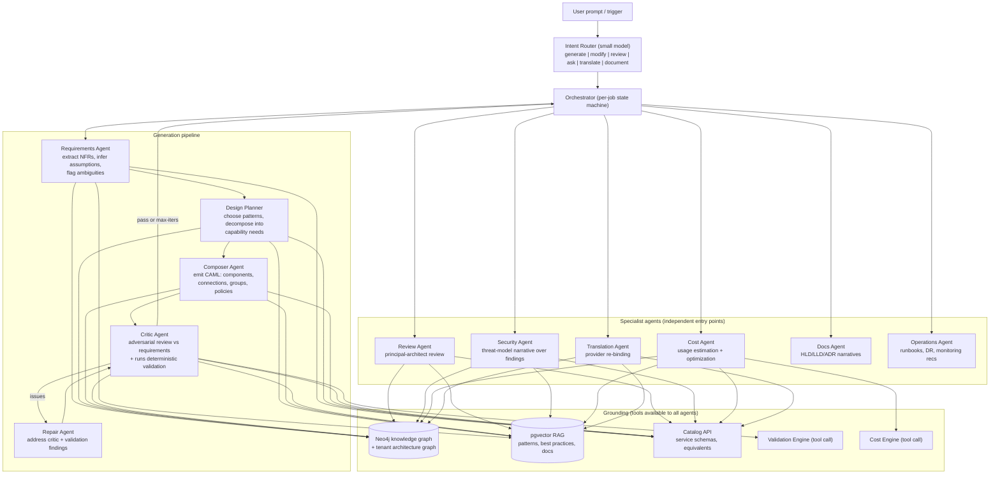

# 07 — AI Architecture

## Design Philosophy

1. **AI emits CAML, never prose-to-be-parsed.** Every agent's contract is schema-
   constrained structured output validated against CAML + catalog schemas before anything
   reaches the user. Invalid output → automatic repair loop (error fed back) → fail
   gracefully with partial results, never a broken model.
2. **Grounded, not vibes.** Agents query the knowledge graph and RAG corpus; system
   prompts contain the *method*, retrieval supplies the *facts*. Cloud facts (service
   limits, pricing, compliance mappings) come from the versioned catalog — the same source
   validation uses — so AI and deterministic engines can't disagree about reality.
3. **Deterministic engines decide; AI proposes and explains.** Validation findings, cost
   numbers, and diffs come from deterministic code. AI ranks, explains, remediates, and
   designs. This keeps trust auditable.
4. **Everything is a proposal on a branch.** AI output lands as commits on `ai/*`
   branches; humans review and merge. No agent ever mutates `main` or touches a customer
   cloud.

## Model Strategy

| Task | Model tier | Rationale |
|---|---|---|
| Architecture generation, review, translation | Frontier (Claude Opus-class) | Deep multi-constraint reasoning; quality is the product |
| Requirement extraction, chat, doc narratives | Mid (Claude Sonnet-class) | Latency/cost balance, high volume |
| Classification, label mapping, intent routing | Small (Haiku-class) | <500ms, pennies |
| Embeddings | Dedicated embedding model (1024-dim) | Catalog/pattern/doc retrieval |

Provider abstraction layer (LiteLLM-style internal interface) for fallback and
enterprise BYO-model (Bedrock/Vertex endpoints for data-residency-sensitive customers).
Prompts live in a versioned **prompt registry** (prompts-as-code, evaluated in CI —
see Evaluation below).

## Agent Topology

Orchestration is a **typed state machine per job kind** (LangGraph-style, built on our own
thin layer — doc 13), checkpointed to Postgres so jobs survive worker restarts; every
step logged to an `AgentTrace` (S3) for debugging, audit, and eval harvesting.

## Generation Pipeline in Detail

**Input:** *"Design a highly available multi-region e-commerce platform on AWS serving
50M users."*

1. **Requirements Agent** → structured `requirements[]`:
   extracts (AWS, multi-region, HA, 50M users, e-commerce); **infers and labels
   assumptions** (peak ~30k RPS from 50M MAU heuristics, PCI likely, RPO≤5m/RTO≤1h,
   budget unstated). Output: CAML `requirements[]` with `source: inferred` + confidence.
   Low-confidence ambiguities → one round of clarifying questions in the copilot panel
   (skippable — "proceed with assumptions").
2. **Design Planner** → retrieves candidate patterns (vector search over `ReferencePattern`
   + graph query for pattern compatibility); selects e.g. `web-multi-region-active-passive`
   + `commerce-core` + `cdn-waf-edge`; outputs a **capability plan** (list of abstract-type
   needs + topology sketch + pattern citations).
3. **Composer** → emits full CAML in sections (groups → components → connections →
   policies) using **constrained decoding against the CAML JSON Schema**; binds services
   via catalog lookups (never from memory); attaches `DesignRationale` per major choice.
4. **Critic** → independently checks model vs requirements ("req-availability: is there a
   single-region SPOF?"), then **calls the deterministic Validation Engine as a tool**;
   merges its own findings with engine findings.
5. **Repair** → fixes findings (max 3 iterations); unresolved items become annotations on
   the proposal ("known tradeoff: ...").
6. Commit to `ai/gen-{id}` branch + open merge request; UI streams stages live (plan →
   skeleton diagram → bound services → validation badge) over WebSocket.

**Latency budget:** first visual skeleton < 8s, complete proposal < 30s for ~60-component
models (sectioned generation parallelizes composer calls per group).

## Modification Flow (chat-edit on existing models)

"Make the database multi-region" on a 200-component model does **not** regenerate:
1. Scope resolver (graph query): which components match? → `orders-db` + its replicas.
2. Composer runs in **patch mode**: receives only the relevant subgraph + invariants,
   emits a CAML JSON-Patch (IDs preserved — enforced post-check, doc 05).
3. Critic validates the patched model; result is a small, reviewable diff.

## RAG Corpus & Knowledge Graph Grounding

| Corpus (pgvector) | Source | Refresh |
|---|---|---|
| Reference patterns | Internal, curated, reviewed like code | Per catalog release |
| Provider best practices | AWS Well-Architected, Azure CAF, GCP Architecture Framework (summarized into our own canonical statements with citations) | Quarterly |
| Service docs digests | Per-catalog-service capability notes, limits, gotchas | Per catalog release |
| Compliance mappings | Rule ↔ control evidence text | Per pack release |
| Tenant corpus (enterprise) | Customer's own ADRs, standards, merged architectures | Continuous; **strictly tenant-filtered at query time** |

Graph grounding examples agents use as tools:
- `equivalents(service, target_provider)` → translation candidates + fidelity
- `common_topology(serviceA, serviceB)` → how these usually connect (edge stats across
  patterns + anonymized aggregate usage)
- `blast_radius(component, commit)` → what depends on this (modification safety)

## Specialist Agents

- **Review Agent** ("review as a Principal Architect"): input = commit + validation report
  + cost estimate + requirements; output = structured review {strengths, weaknesses,
  risks (likelihood × impact), recommendations (effort-ranked), alternatives (each with a
  sketch CAML delta the user can apply in one click)}. Cached by (commit, prompt-version).
- **Translation Agent**: deterministic first pass re-binds via `EquivalenceMapping`
  (fidelity ≥ 0.85 auto); agent handles the hard residue — architectural idiom shifts
  (e.g. AWS Transit Gateway hub-spoke → Azure vWAN; DynamoDB single-table → Cosmos DB
  partition strategy), emitting per-decision fidelity notes. Output: new model lineage
  linked `translated_from`, with a translation report table (source → target → fidelity →
  caveats).
- **Security Agent**: builds attacker-perspective narrative over deterministic findings:
  entry points → reachable paths (graph queries) → data classification exposure → STRIDE
  tags → prioritized hardening plan. Feeds the Security Review document.
- **Cost Agent**: turns requirements into usage profiles (RPS → instance-hours, storage
  growth curves), calls Cost Engine for numbers, writes optimization recommendations
  (rightsizing, commitment plans, storage tiering, architecture alternatives with cost
  deltas — "moving image resize to Lambda saves ~$3.1k/mo at your stated load").
- **Ops/DR Agent**: monitoring gaps (every component's `operations` block vs catalog
  expectations), runbook generation per failure mode, DR recommendations vs stated
  RPO/RTO with concrete CAML deltas (add replication connection, pilot-light region).

## Guardrails & Safety

| Risk | Control |
|---|---|
| Invalid/hallucinated services | Constrained decoding + catalog existence check; unknown service → repair loop |
| Prompt injection (via imported diagrams, discovery data, doc names) | All retrieved/imported content wrapped in data-only delimiters; agents instructed + output-checked; tool allowlist per agent; no agent has cloud-write or network-egress tools |
| Cross-tenant leakage | Retrieval hard-filtered by tenant; tenant corpora in separate namespaces; eval suite includes canary leak tests |
| Cost runaway | Per-tenant monthly token budgets (Redis counters), per-job caps, model-tier routing |
| Confidently wrong designs | Critic + deterministic validation always run; assumptions surfaced explicitly; UI shows "AI proposal" provenance on every commit |
| PII/secrets in prompts | Pre-flight scanner strips credentials/keys from imported IaC & discovery payloads before any model call |

## Evaluation (treated as a first-class subsystem)

- **Golden suite**: 200+ prompt → expected-properties test cases ("multi-region" must
  yield ≥2 region groups; "PCI" must enable encryption policies...) asserted structurally
  on output CAML — runs on every prompt/model/catalog change.
- **Validation-pass rate**: % of generations with zero critical findings pre-repair —
  the north-star quality metric.
- **Human feedback loop**: every accepted/edited/rejected proposal logged as preference
  data (accepted-with-edits diffs are gold); weekly eval review; quarterly fine-tune
  decision point.
- **Translation fidelity benchmarks**: round-trip tests (AWS→Azure→AWS structural
  similarity scoring).

## Token & Cost Model (unit economics)

| Job | Typical tokens (in/out) | Est. cost @ frontier pricing | Price signal |
|---|---|---|---|
| Full generation (60 comp) | 60k / 25k | ~$1.20 | Pro plan includes 50/mo |
| Review | 30k / 8k | ~$0.45 | |
| Chat edit | 12k / 3k | ~$0.15 | |
| Doc pack (HLD+LLD+ADR) | 45k / 30k | ~$1.10 | |

Margin protected by: aggressive prompt caching (catalog/system segments are stable),
result caching by commit hash, model-tier routing, and metered enterprise overage.
