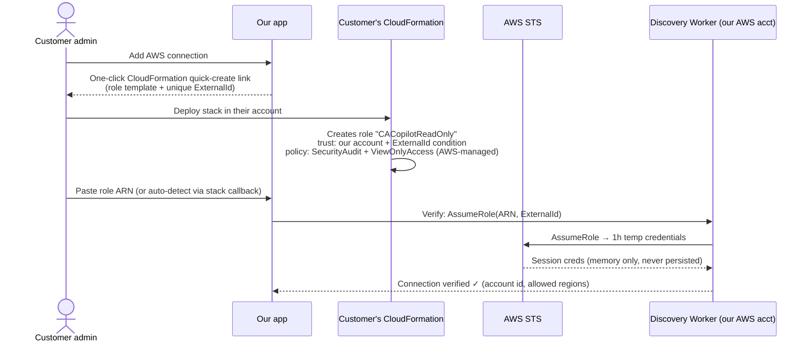
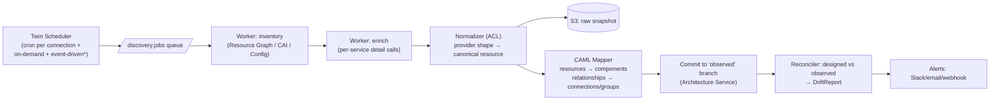

# 09 — Cloud Discovery & Digital Twin Architecture

## Trust Model (the part enterprises will diligence hardest)

Non-negotiable principles:

1. **Read-only, forever.** v1–v3 connectors request zero write permissions. The product
   never mutates customer clouds. (Deployment happens via *generated IaC through the
   customer's own pipeline*, optionally as a PR we open — never direct API writes.)
2. **No long-lived secrets stored.** Every provider integration uses federated /
   role-assumption auth; we store identifiers, never keys, wherever the provider allows.
3. **Customer-revocable in one click** on their side (delete the role/SP/binding).
4. **Scoped + transparent**: customers choose regions/resource filters; every scan is
   audit-logged with exactly which API calls were made.

## Per-Provider Connection Design

### AWS — cross-account IAM role

- **ExternalId** (unique per connection, stored hashed) kills the confused-deputy attack.
- Permissions: AWS-managed `SecurityAudit` + `ViewOnlyAccess` — auditable by the
  customer's security team at a glance; optional minimal custom policy for the
  paranoid (we publish it, ~80 actions, all `Describe*/List*/Get*`).
- Discovery strategy per account: prefer **AWS Config aggregator / Resource Explorer**
  if the customer has them (cheap, complete); fall back to parallel `Describe*` fanout
  per service × region with adaptive rate limiting (respect API throttles, exponential
  backoff, ~10 min for a 5k-resource account).

### Azure — Entra ID app + least-privilege role

- Customer grants our multi-tenant Entra application the built-in **Reader** role on
  chosen subscriptions/resource groups (admin-consent flow, no secret exchanged when
  using **federated credentials/workload identity**; fallback: customer-created SP with
  certificate uploaded to their own vault — enterprise option: customer-hosted agent).
- Discovery: **Azure Resource Graph** first (single Kusto query surface for full
  inventory — fast and cheap), per-resource-provider `GET`s for config details Resource
  Graph omits.

### GCP — Workload Identity Federation

- Customer creates a service account in their project, grants `roles/viewer` +
  `roles/cloudasset.viewer`, and adds a **Workload Identity Federation** binding trusting
  our platform's identity pool — **zero keys ever created**.
- Discovery: **Cloud Asset Inventory API** (`assets.list` / `exportAssets`) gives
  near-complete inventory in a handful of calls; supplement with service-specific APIs.

### Enterprise option: customer-hosted collector agent
For air-gapped/regulated tenants: a containerized collector runs **inside** the customer
network with their own credentials, pushes normalized inventory (outbound-only, mTLS) to
our ingest endpoint. Same normalization pipeline downstream.

## Discovery Pipeline

\* Event-driven (enterprise, optional): customer forwards CloudTrail/EventBridge,
Azure Activity Log, or GCP Audit Log feed → near-real-time drift instead of polling.

### Normalization & mapping rules

1. **Resource → component**: provider resource type → catalog service key
   (`AWS::RDS::DBInstance` → `aws.rds`); properties mapped via per-service adapters;
   unmapped types → `generic.unmodeled` (preserved raw, visible on canvas as gray nodes).
2. **Relationships → connections/groups**:
   - Containment from provider structure (VPC/subnet/resource-group/project → `groups[]`).
   - Edges inferred from configuration: SG/NSG/firewall rules → permitted `traffic`
     connections; IAM/event-source mappings → `async`/`identity` edges; DNS/LB target
     groups → routing edges. (Config-derived edges are *potential* connectivity —
     labeled as such; flow-log-derived *actual* traffic edges are a Phase 5 enrichment.)
3. **Identity matching designed ↔ observed** (the hard problem), in precedence order:
   - Tags we inject into generated IaC (`cacopilot:component-id = orders-db`) — exact.
   - Resource naming conventions from the deployment binding.
   - Structural fingerprint matching (type + group + connection signature similarity).
   - Unmatched observed → "unexpected resource"; unmatched designed → "missing resource".

## Drift Detection & Classification

Drift = `ModelDiff(designed_head, observed_head)` post-matching, classified:

| Class | Example | Default action |
|---|---|---|
| `acceptable` | Autoscaling count changed, ephemeral resources, tags in ignore-list | Suppressed (SyncPolicy rules) |
| `review` | Instance resized, new subnet appeared | Notification + drift inbox |
| `violation` | SG opened to 0.0.0.0/0, encryption disabled, public DB | Alert + auto-run validation + webhook |

Resolution workflows (both are one click, both produce commits — audited like all else):
- **Accept reality**: merge observed change into designed model.
- **Reject reality**: keep design; generate the corrective IaC diff for the customer's
  pipeline to re-converge.

## "Import my account" (greenfield onboarding flow)

First scan of a connection with no designed model: observed commit → auto-layout
(ELK, clustered by VPC/region) → user prunes noise (wizard suggests hiding
default/ephemeral resources) → "promote to designed model" creates `main` from the
pruned observed state. **This is the killer onboarding demo: live account → editable,
validated architecture diagram in under 15 minutes.**

## Security Properties of the Sync Plane

| Property | Implementation |
|---|---|
| Network isolation | Sync plane in dedicated VPC/namespace; egress allowlist = cloud provider API endpoints only; no route to other planes except Kafka + Architecture Service API |
| Credential hygiene | STS/WIF tokens in worker memory only; zeroed after job; never logged; no disk spill |
| Blast-radius per tenant | One worker process never holds credentials for two tenants concurrently; jobs pinned per connection |
| Auditability | Every cloud API call logged (service, action, region, count) into the tenant-visible scan report |
| Snapshot encryption | Raw inventories: S3 SSE-KMS with per-tenant key (enterprise: CMK in customer's KMS via grant) |
| Rate-limit citizenship | Adaptive throttling so we never degrade the customer's own API quotas |
