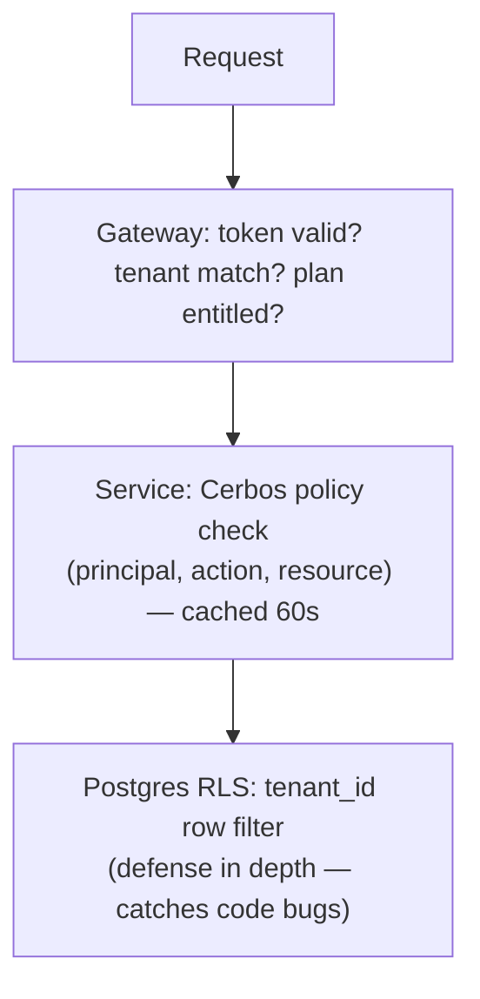

# 10 — Security Architecture

Threat framing: we store customers' **architecture blueprints** — documents that describe
exactly how to attack their infrastructure — plus read credentials *pathways* into their
clouds. We must be SOC 2 Type II by GA and credibly answer "what if you're breached."

## Authentication

| Mechanism | Detail |
|---|---|
| Email+password | Argon2id hashing; breach-list screening; optional and discouraged for teams |
| OAuth social | Google/GitHub/Microsoft via OIDC |
| Enterprise SSO | SAML 2.0 + OIDC via WorkOS; per-tenant enforced ("SSO-only" tenant policy); SCIM provisioning/deprovisioning |
| MFA | TOTP + WebAuthn/passkeys; tenant policy can mandate |
| Sessions | 15-min access JWT (RS256, kid-rotated) + 7-day one-time-use refresh tokens with family-reuse detection → full family revocation |
| Service accounts | Scoped API keys (prefix + Argon2 hash stored), per-key rate limits, last-used tracking, expiry |
| Token claims | `sub, tenant_id, ws_roles (compact), plan, auth_method, mfa, session_id` — gateway verifies and forwards as signed internal headers; services never parse raw client tokens |

## Authorization — layered RBAC

**Role matrix (scope: tenant / workspace / architecture):**

| Action | Viewer | Reviewer | Editor | Architect | Admin | Owner |
|---|---|---|---|---|---|---|
| View architectures, reports | ✓ | ✓ | ✓ | ✓ | ✓ | ✓ |
| Comment | | ✓ | ✓ | ✓ | ✓ | ✓ |
| Approve merge requests | | ✓ | | ✓ | ✓ | ✓ |
| Edit models, run AI | | | ✓ | ✓ | ✓ | ✓ |
| Merge protected branches, manage waivers | | | | ✓ | ✓ | ✓ |
| Manage members, cloud connections | | | | | ✓ | ✓ |
| Billing, SSO config, tenant deletion | | | | | | ✓ |

- Policies in **Cerbos** (declarative YAML, versioned, testable) — supports enterprise
  custom roles and attribute conditions ("editors may not export IaC for architectures
  tagged `pci`") without code changes.
- AI agents act **on behalf of the requesting user** with the user's permissions —
  never a superuser service identity for tenant data access.

## Tenant Isolation (the existential property)

| Layer | Control |
|---|---|
| API | tenant_id from token only — never from request body/path trust |
| DB | RLS on every tenant table; `SET LOCAL app.tenant_id` per transaction; CI test suite attempts cross-tenant reads against every endpoint (fails build on leak) |
| Cache | tenant_id in every Redis key; no shared key namespaces |
| Search/vector | tenant filter mandatory at query construction (typed query builder makes it unrepresentable to omit) |
| AI | retrieval namespaces per tenant; prompt-injection canaries in eval suite |
| Events | tenant_id in every event; consumers re-verify |
| Blobs | per-tenant S3 prefixes + bucket policy; presigned URLs scoped + 5-min expiry |
| Enterprise tier | dedicated cell (own DB cluster + Neo4j + workers) or BYOC deployment |

## Encryption

| State | Mechanism |
|---|---|
| In transit | TLS 1.2+ external; mTLS service-to-service (mesh-issued certs, SPIFFE identities) |
| At rest | AES-256 across Postgres/Redis/S3/Kafka volumes (KMS-managed) |
| Field-level | Cloud connection configs, SSO secrets, webhook signing keys: envelope-encrypted (per-tenant DEK wrapped by KMS CMK) before hitting Postgres |
| Enterprise CMK | Tenant-supplied KMS key via grant; key revocation = tenant data cryptographically inaccessible |
| Key rotation | CMKs yearly (automatic), DEKs on demand + on suspicion; JWT signing keys quarterly with overlap window |

## Secrets Management (ours)

- **No secrets in env vars or code.** All service secrets in AWS Secrets Manager /
  Vault, injected at runtime via CSI driver, rotated automatically (DB creds 30d).
- CI: OIDC federation to cloud (no stored deploy keys); signed commits; SLSA-aligned
  build provenance; image signing (cosign) + admission verification.
- Pre-commit + CI secret scanning (gitleaks); customer-uploaded IaC scanned and
  **secrets redacted before storage or any AI call**.

## Audit Logging

- Every authz-relevant action → `audit_events` (doc 04) → ClickHouse, immutable,
  hash-chained per tenant per day (tamper-evidence), 7-year retention tier.
- Tenant-visible audit UI + export (SIEM push: S3 drop / Splunk HEC / webhook).
- Covers: auth events, RBAC changes, model merges, waiver grants, AI jobs (prompt hash,
  not content, unless tenant opts in), cloud connection changes, **every discovery scan's
  API call inventory**, exports/downloads (who exported the PCI architecture PDF, when).

## Application Security Program

| Area | Practice |
|---|---|
| SDLC | Threat model per epic (STRIDE-lite); security review gate on auth/crypto/tenant-boundary changes |
| Dependencies | Renovate + SCA (OSV/Snyk); base images distroless; weekly rebuild |
| SAST/DAST | Semgrep custom rules (e.g. "query without tenant filter"), CodeQL; quarterly pentest + private bug bounty at GA |
| AI-specific | Prompt injection test corpus in CI; tool allowlists per agent; no egress from AI workers except model API; output schema validation as injection containment |
| Abuse | Per-tenant + per-IP rate limits; AI budget caps; export watermarking on free tier; bot detection at edge |
| IR | 24/7 on-call, runbooked sev matrix; customer notification SLA 72h (contractual); tabletop twice yearly |

## Compliance Roadmap

| Milestone | Target |
|---|---|
| SOC 2 Type I | End of Phase 2 (controls designed) |
| SOC 2 Type II | GA / Phase 3 (12-month observation overlapping) |
| ISO 27001 | Phase 5 (EU enterprise demand) |
| GDPR | Day one: DPA, EU data residency option (EU cell), deletion workflows (30-day hard delete incl. backups via crypto-shredding) |
| HIPAA BAA / FedRAMP | Demand-driven; BYOC deployment is the pragmatic answer for both early on |
