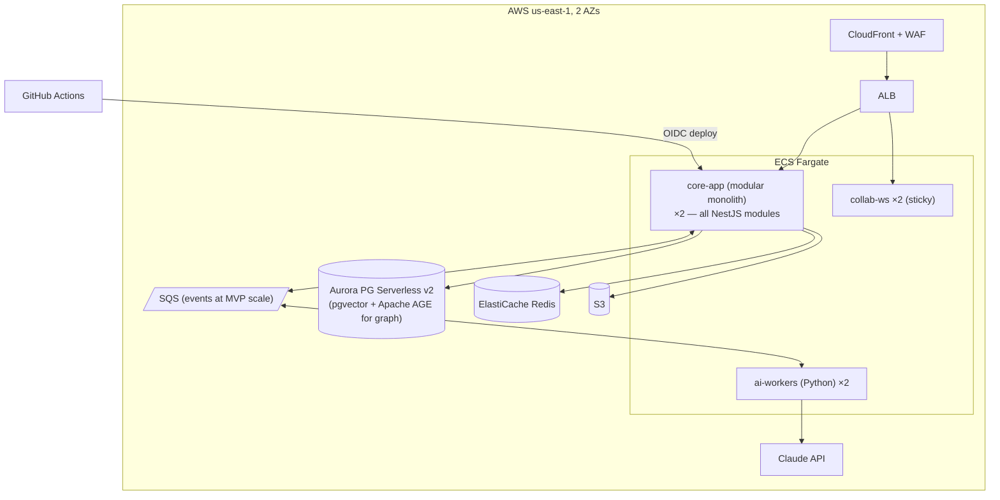
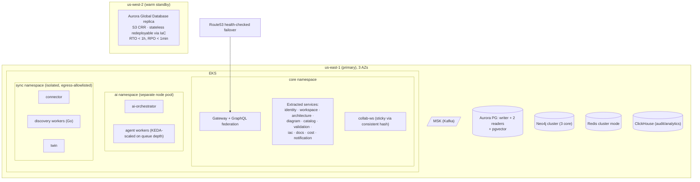
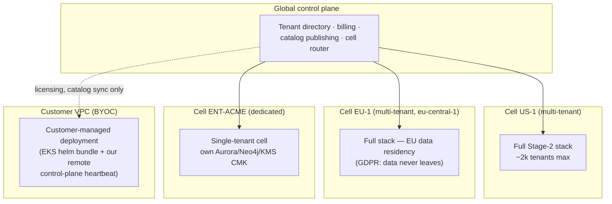

# 11 — Deployment Architecture

Three stages, each a strict superset — no re-architecture between stages, only
re-topology. Home cloud: **AWS** (team familiarity, Bedrock proximity for BYO-model
enterprise asks); nothing below is AWS-coupled beyond managed-service choices.

## Stage 1 — MVP (Phase 1–2, first ~12 months)

**Goal: maximum iteration speed, minimum ops surface. ~$1.5–2.5k/mo infra.**

**Deliberate simplifications:** modular monolith (logical service boundaries, one
deployable); SQS instead of Kafka (CloudEvents envelope kept → swap is config); graph
queries via Apache AGE in Postgres (Neo4j deferred until structural-rule complexity
demands it); discovery workers run as Fargate scheduled tasks; single region; no mesh.
**Kept from day one (cheap now, brutal to retrofit):** CAML+commits model, RLS tenant
isolation, outbox events, immutable artifacts in S3, OTel everywhere, IaC for our own
infra (CDK — dogfooding), audit log.

## Stage 2 — Production SaaS (Phase 3–4)

**Goal: 99.9%, thousands of tenants, SOC 2 Type II surface. ~$15–30k/mo.**

**Operational stack:** ArgoCD GitOps; Istio/Linkerd mTLS mesh (SPIFFE); Karpenter node
autoscaling; HPA on RPS/queue depth; OTel → Grafana/Mimir/Loki/Tempo; PagerDuty;
per-tenant SLO dashboards; load tests in CI (k6) gating release; chaos days quarterly.
**Migration from Stage 1:** services extracted one bounded context at a time (strangler
on the monolith's module seams); SQS→Kafka behind the event-publisher interface;
AGE→Neo4j behind the graph-query port.

## Stage 3 — Enterprise (Phase 5)

**Goal: 99.95%, data residency, dedicated isolation, BYOC.**

**Cell architecture rationale:**
- A cell = complete vertical stack, ≤ ~2k tenants. Blast radius (incident, bad deploy,
  noisy neighbor) capped at one cell. Tenant→cell mapping at signup (region/plan);
  migration tooling for upgrades to dedicated cells.
- Global control plane holds only: tenant directory, auth federation metadata, billing,
  catalog publishing, status. **No customer architecture data leaves its cell.**
- Catalog and rule packs are published artifacts pulled by cells — also what makes BYOC
  viable (BYOC pulls signed catalog/prompt bundles; sends only license heartbeats +
  anonymized health metrics out).
- Active-active multi-region *within* a cell is intentionally avoided — Aurora Global +
  warm standby meets 99.95% far more cheaply than multi-master semantics for our write
  patterns (collab CRDTs make eventual cross-region authoring a Phase 6+ research item).

## Environments & Release

| Env | Purpose | Data |
|---|---|---|
| dev (per-PR ephemeral) | Preview deploys (Argo + vcluster) | Seeded fixtures |
| staging | Full stack, prod-shaped | Synthetic + opt-in mirrored anonymized models |
| prod cells | Customers | Real |

Release: trunk-based, feature flags (OpenFeature + homegrown store), canary 5%→25%→100%
with automated SLO-burn rollback; DB expand-and-contract; weekly release train, hotfix
lane < 2h. AI prompt/catalog releases follow the same pipeline with eval gates (doc 07).

## Cost-of-Goods Model (Stage 2, per-tenant unit economics)

| Driver | Est. monthly @ 1k active Pro tenants |
|---|---|
| Compute (EKS, all planes) | ~$9k |
| Data (Aurora, Neo4j, Redis, MSK, CH) | ~$8k |
| LLM tokens (after caching) | ~$6k (≈$6/tenant — priced at $49) |
| Egress/CDN/misc | ~$2k |
| **COGS / revenue** | **~25% → 75% gross margin** (target ≥70% at scale) |
