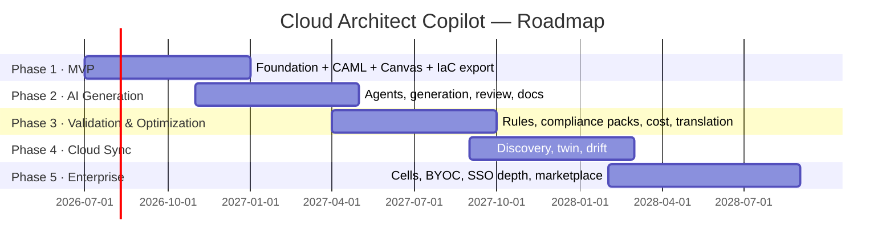

# 12 — Development Roadmap

Five phases over ~30 months. Each phase ends with a sellable increment; revenue starts in
Phase 1. Dates assume funding close T0 = month 0.

---

## Phase 1 — MVP (Months 0–6) · "The semantic canvas"

**Thesis to prove:** architects will design in a *typed* canvas if it pays off instantly
(validated properties, instant Terraform, beautiful exports).

| Track | Features |
|---|---|
| Core | CAML 1.0 + JSON Schema; commit/branch model (linear history UI only); workspaces, RBAC (4 roles); catalog v1: **AWS-only, 60 services** (the full list in the brief: VPC→IAM) |
| Canvas | React Flow editor: palette, drag-drop, connect, groups/containment, zoom/pan, copy/paste, undo/redo, keyboard map, ELK tidy-up; PNG/SVG/PDF export; Draw.io import (beta) |
| Generation | Terraform export (the 60 services, golden-tested); HLD markdown export |
| Platform | MVP deployment (doc 11 Stage 1); auth incl. Google/GitHub OAuth; Stripe billing (Free/Pro); audit log foundations |

**Team (8):** 2 frontend (canvas), 2 backend, 1 full-stack (auth/billing/admin),
1 founding designer, 1 catalog/devrel engineer (service schemas + icons + Terraform
templates), 1 EM/architect (hands-on). *AI engineers hired late in phase for P2.*

**Exit criteria:** 500 weekly-active designers; 20 paying teams; diagram→Terraform demo
< 5 min; NPS-style "would be disappointed" > 30%.

**Risks:**
| Risk | Mitigation |
|---|---|
| Canvas polish swallows the phase (it always does) | React Flow not custom; cut features (no layers UI, no Visio import) before cutting quality; weekly usability tests from week 6 |
| Catalog authoring underestimated (60 services × schema × icons × TF templates) | Dedicated catalog engineer; schema-driven forms mean no per-service UI work; golden tests catch template rot |
| "Another diagram tool" positioning | Lead marketing with IaC export + typed validation, never with drawing |

---

## Phase 2 — AI Generation (Months 4–10, overlaps P1) · "The copilot"

**Thesis:** NL → reviewable architecture proposal beats starting from a blank canvas.

| Track | Features |
|---|---|
| AI | Generation pipeline (requirements → planner → composer → critic, doc 07); streaming canvas draw; chat modify (patch mode); assumptions UI; AI review (principal-architect); prompt registry + eval harness (golden suite ≥ 150 cases before GA) |
| Core | Full branch/merge/MR workflow with model diff UI (needed for AI proposals); rationale capture; pattern library v1 (25 curated patterns) |
| Docs | HLD/LLD/ADR generation |
| Catalog | Azure + GCP catalogs (60 equivalent services each); equivalence mappings authored |

**Team (13):** +3 AI engineers, +1 backend, +1 product designer.
**Exit criteria:** ≥70% of generations merged with < 10 manual edits; AI feature attach
rate > 60% of WAU; validation-pass-pre-repair > 80% on golden suite; $25k MRR.

**Risks:**
| Risk | Mitigation |
|---|---|
| Generation quality below "wow" | Eval-gated launch; constrain scope to patterns we've curated; critic+repair loop; beta cohort feedback loop weekly |
| LLM cost erodes margin | Caching + tiered models from day one; token budgets; monitor $/generation weekly |
| AI proposals erode trust when wrong | Always-on provenance labels, assumptions surfaced, deterministic validation visibly separate from AI opinion |

---

## Phase 3 — Validation & Optimization (Months 10–16) · "The judge"

**Thesis:** teams pay 2× more when the tool *proves* architectures are sound and prices
them.

| Track | Features |
|---|---|
| Validation | Rule engine GA (CEL + graph rules); baseline pack (~150 rules across reliability/security/perf/cost/ops); compliance packs: CIS (AWS/Azure/GCP), NIST 800-53, PCI DSS 4.0, HIPAA, SOC 2; waiver workflow; custom rules (enterprise beta) |
| Cost | Pricing ingestion (3 providers); estimates on every commit; cost delta on every MR; optimization agent; usage profiles |
| Translation | AWS↔Azure↔GCP translation GA (mapping-first + agent residue, fidelity reports) |
| Collab | Comments, reviews, approvals, protected branches; Team plan launch |
| Platform | Stage-2 deployment (EKS, Kafka, Neo4j); SOC 2 Type I → II clock starts; CLI v1 (`cac validate/diff/export` in CI) |

**Team (19):** +2 backend (rules/cost), +1 Go/infra, +1 security engineer, +1 PM, +1 SRE.
**Exit criteria:** validation run on > 80% of active architectures; first 10 customers
gating CI on `cac validate`; $100k MRR; SOC 2 Type I issued.

**Risks:** rule false-positive rate poisons trust (tune on real tenant corpus; severity
humility; waivers cheap) · compliance pack accuracy is a legal-ish claim (external
auditor review of packs; "evidence assist, not certification" framing) · pricing data
drift (nightly ingestion canaries vs known quotes).

---

## Phase 4 — Cloud Synchronization (Months 16–22) · "The twin"

**Thesis:** the diagram that *stays true* is a category-defining feature — converts
documentation-tool budget into ops budget.

| Track | Features |
|---|---|
| Connect | AWS/Azure/GCP read-only connectors (doc 09); onboarding wizards (CFN quick-link etc.) |
| Discover | Full inventory → CAML mapping; "import my account" onboarding (live account → editable model < 15 min) |
| Twin | Scheduled + on-demand scans; designed↔observed matching (IaC tag injection); drift reports, classification, drift inbox; accept/reject reconcile flows; Slack/Teams/webhook alerts |
| Platform | Sync-plane isolation hardening; per-tenant scan audit reports; event-driven drift (CloudTrail feed) enterprise beta |

**Team (24):** +3 Go/cloud-integration engineers (one per provider as DRI), +1 SRE,
+1 solutions engineer.
**Exit criteria:** 300 connected cloud accounts; drift MTTD < 1h (scheduled) / < 5 min
(event-driven beta); discovery accuracy > 95% of resources correctly mapped on benchmark
accounts; $300k MRR.

**Risks:** provider API breadth is a grind (catalog-first: map the 60+60+60, gray-node
the rest honestly) · security diligence stalls deals (publish connector security
whitepaper + pentest report proactively) · matching accuracy on non-IaC-tagged estates
(ship confidence scores; human-confirm wizard; improves with usage data).

---

## Phase 5 — Enterprise Platform (Months 22–29) · "The standard"

**Thesis:** become the system of record for architecture in regulated enterprises.

| Track | Features |
|---|---|
| Enterprise | Cell architecture + EU cell (residency); dedicated cells; BYOC (helm distribution + signed catalog sync); CMK; SCIM; custom roles; SIEM export; ISO 27001 program |
| Governance | Architecture standards engine (org-wide policies inherited by every model); portfolio dashboards (estate-wide findings, cost roll-ups, drift posture); approval chains |
| Ecosystem | Public API GA + TS/Python SDKs; ServiceNow/Jira/Confluence/Backstage integrations; community pattern marketplace (revenue share); Visio import GA |
| AI | Tenant private knowledge (own ADRs/standards ground the copilot); BYO-model endpoints (Bedrock/Vertex); ops/DR agents GA |

**Team (32):** +2 enterprise backend, +1 partner/integrations engineer, +2 sales
engineers, +1 compliance lead, +1 PM.
**Exit criteria:** 10 enterprise logos ≥ $100k ACV; 1 BYOC deployment live; $1M+ MRR;
marketplace seeded with 200+ patterns.

**Risks:** BYOC support burden (strict version matrix, remote diagnostics bundle,
premium-priced) · enterprise sales cycle vs runway (start co-design councils in Phase 3;
land-and-expand via Team plan) · feature sprawl vs core quality (portfolio governance is
the only net-new surface; everything else deepens existing planes).

---

## Cross-Phase Engineering Invariants

1. **Catalog discipline**: every service added = schema + icons + TF/CDK/Pulumi/CFN
   templates + cost dimensions + equivalence row + eval cases. One definition of done.
2. **Eval-gated AI releases** from Phase 2 forever.
3. **The commit model is sacred** — no feature may bypass the Architecture Service write
   path, ever. This single rule keeps audit, versioning, validation, and twin coherent.
4. **Quarterly "competitor demo day"**: rebuild our best demo in Lucidchart/Cloudcraft/
   Brainboard; if the gap isn't obvious, fix product before roadmap.
